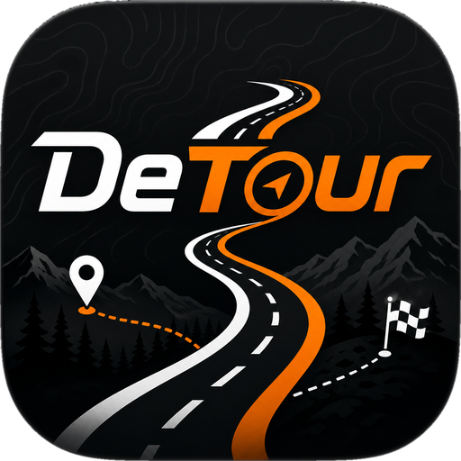
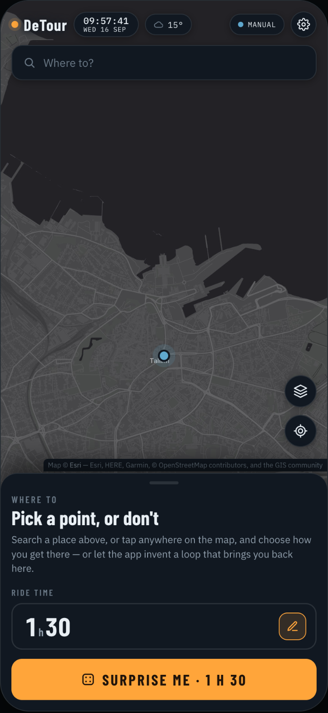
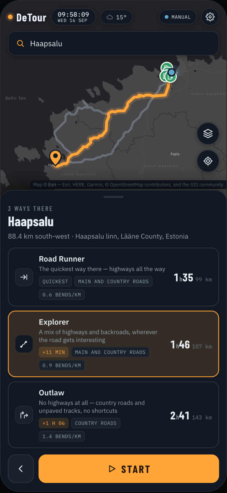
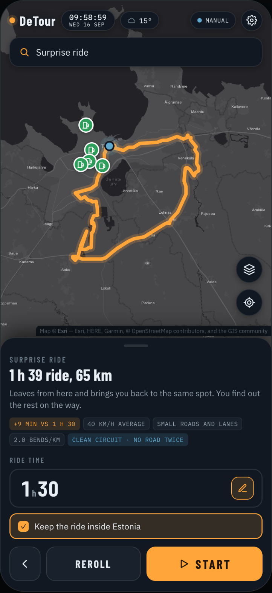

  

<h1 align="center">DeTour</h1>

<a href="https://alyxfpv.github.io/DeTour/"><b>Open the app</b></a>

You either name a place and choose *how* you get there, or you name nothing and the app invents a ride that brings you home. Either way the finished route is handed to the navigation app you already use.

  
  
  

---

https://alyxfpv.github.io/DeTour/

## The file

### `DeTour.html`

Runs on live data. **Double-click it and it opens in your browser.** It needs GPS and an internet connection — there is no offline mode.

- **Map** — OpenStreetMap data, rendered by CARTO, light and dark to match your system, or Esri satellite imagery with roads and place names draped over it — the layers button above "centre on me" switches between them.
- **Search** — Nominatim, OpenStreetMap's own geocoder. Addresses, towns, places, or a raw coordinate pair.
- **Routing** — the public OSRM demo server. Real roads, real distances, real times.
- **Position** — your device's GPS, or a start point you set by hand.
- **Fuel stations** — always on, marked over either basemap. Fetched from Overpass for whatever's on screen, once zoomed in past street level; panning further just fetches the new ground, not what's already been covered, and a failed fetch is retried rather than left blank.
- **Language** — English, Русский, or Eesti keel, from Settings → Language. Switching translates the whole interface — buttons, route cards, toasts, modals, the works — and is remembered for next time. Place and country names also switch language, since they come from the same geocoder the search box uses.
- **Appearance** — Dark Mode, Light Mode, or Automatic, from Settings → Appearance. Automatic works out actual sunrise and sunset at wherever you are — not just the phone's own light/dark switch — and moves the map between them on its own; it falls back to the phone's setting before a start point is known, or somewhere the sun doesn't rise or set that day.
- **Clock and weather** — tap the clock for a plain read-only calendar, current month, today picked out, with buttons either side to look forward or back. Tap the weather chip for the detail behind that one number: feels-like, wind speed and direction, gusts, precipitation, humidity, and the next six hours at a glance — the things that actually matter from a saddle.

**Pick a destination** — search it, or tap the map — and you get three ways there:

| | what wins it |
|---|---|
| **Fastest** | shortest time |
| **Interesting** | bends per kilometre, and small roads |
| **The long way round** | distance and the smallest roads of all |

**Or press Surprise me** and say how long you've got, not how far you want to go. Tap the ride-time button for presets — 30 min, 1 h, 1 h 30, 2 h, 3 h, 4 h — or type your own number of hours below them. The app works out how far that buys at the pace this rider's rides actually average, builds a closed loop that leaves your position and returns to the exact same spot, and checks the loop it got back against the clock: if OSRM's estimate lands more than about 12% off the time you asked for, it re-sizes the loop once and tries again. Every ride refines the pace estimate for the next one, stored locally.

Leaflet is compiled into the file, so the only things it reaches out for are the map tiles and the two OSM services.

---

## How the three route characters are found

OSRM has no "curvy roads" profile, so DeTour works it out itself.

It asks OSRM for the fastest route plus alternatives, then probes two more candidates by routing through a point pushed out to the side of the direct line. Every candidate gets measured on two things:

- **Curviness** — degrees turned per kilometre, taken from the route geometry *after resampling it at a fixed 45 m spacing*. Without that step a straight motorway looks as bendy as a mountain pass, because OSRM packs its points more densely through curves.
- **Average speed** — distance over duration. A reliable proxy for road size: 90 km/h is a motorway, 40 km/h is a lane.

Duplicates are removed by comparing the candidates geometrically — fourteen points sampled along each by distance travelled, then averaged. Comparing rounded coordinates instead collapses every short route into one.

## How the loop is built

The goal is strict: a closed circuit that comes home on different roads from the ones it left on. A ring of waypoints does not deliver that — the router is free to reach each one and come straight back — so the loop is built as **two arcs**.

1. Pick a **far point** about a third of the ride away, in a random direction, and snap it to a road.
2. Lay two bows of waypoints between home and that far point: one bowed out to the left, one to the right, each pushed sideways by a controlled fraction of the distance. Because the outward and return arcs bow to opposite sides, they are physically apart the whole way.
3. **Snap every waypoint to the nearest real road** first, and discard any whose snap distance is large. A long snap means that sector has no roads at all — open sea, or a closed area — and dragging such a point back inland is what folds a loop in on itself.
4. **Check the two arcs are genuinely separated** after snapping. If they have landed on the same corridor there is nothing to gain from routing it, so widen the bow and look again.
5. Route home → outward arc → far point → return arc → home, with **`continue_straight=true`**. Without that flag the router may U-turn at every waypoint, and any shape at all degenerates into a star of spokes.
6. Score on **retracing**, **shape** and **length error**, in that order of importance. Widen the bow when roads are shared, adjust the distance when only the length is off, and restart the search somewhere else entirely when it gets stuck.

### Two tests, because one was not enough

**Shape** is the isoperimetric quotient — `4πA / P²`, where `A` is the area enclosed by the path and `P` is its length. A circle scores 1, a real road loop lands around 0.35–0.6, and **an out-and-back or a star of spokes scores near zero**, because a path that returns along itself encloses no area.

This replaced an earlier check that measured how much of the compass the ride covered from the start. That check could not tell the two apart — a star of spokes points at every quarter of the compass just as thoroughly as a circuit does. On a synthetic circle and a synthetic six-spoke star, the compass test scored 1.00 and 0.50; the area test scores 1.00 and 0.00.

**Retraced fraction** is the second test, and it catches what the first one misses: a genuinely good circuit wearing one dead-end spur. Such a route still encloses plenty of area — it scores 0.70 on shape — but a seventh of it is driven twice. The route is resampled every 25 m and each sample is checked against a spatial hash for another sample sitting within 26 m that was reached at least 500 m earlier along the route. Anything above 8% fails. The first 500 m from home is exempt, because leaving and returning along your own street is normal.

On a synthetic ring and the same ring with one spur: shape 1.00 / 0.70, retraced 0.2% / 14.8%. Only the second test separates them.

When a spur is found, the waypoints sitting at the end of it are dropped and the route is requested again — a targeted repair, rather than rolling a fresh random ring and hoping.

Above 15% retraced the ride is **not offered at all**. The app says no clean circuit exists at that distance from that start and suggests another length, rather than handing over something that doubles back. A loop you have to ride twice is not the thing you asked for.

Measured against a deliberately sparse synthetic road network — a 2.6 km grid with 30% of its links missing, a coastline, and two dead-end peninsulas — twelve loops across four distances came back with eleven shown, nine of them with **0.0% retraced**, none above the limit, and one honest refusal. On real OSM data, where roads are far denser, it does better.

Typical result: shape 0.4–0.9, nothing ridden twice, closing on the spot it started, in two to six seconds.

### Borders

The country under your start is fetched once from Nominatim, with a simplified outline. Every border check after that is local arithmetic — point-in-polygon, no further requests.

By default the ride is kept inside that country: ring waypoints that fall abroad are discarded, and a route with more than 4% of its length over the border is set aside rather than used. The **Keep the ride inside …** switch under the ride-time button turns this off.

When staying home costs a lot of the time you asked for, the app does not quietly hand back a shorter ride. It works out what crossing the border would buy and asks:

> A 3 h loop is possible, but about 87% of it lies outside Estonia. Staying home caps the ride at 1 h 15. Which one?

Both answers are real routes, already found — neither button goes back to the network.

### EU crossings and vignettes

Point-to-point routes and loops both get checked against your start country's EU membership. If a route dips into a country on the other side of that line, it's tagged on the option — *Leaves the EU — via Russia* or *Enters the EU — via Lithuania*, worded for whichever direction you're actually going. Routes that stay within the EU, or within a single non-EU country, get no tag at all — this only fires on an actual membership change, not on every border.

Seven EU countries — Austria, Czechia, Slovakia, Slovenia, Hungary, Bulgaria, Romania — charge for a sticker (a vignette) to use their motorways, rather than tolling per trip. If a route runs along a motorway in one of those, it's tagged *Needs a vignette — Austria*. Checked only when the route is short enough that one extra Overpass query covers it, and only for countries where a vignette is actually a thing — no borders means no tag, and no wasted requests either way.

Both checks reuse the same country lookup as the loop feature above, plus at most one extra Nominatim call and one extra Overpass call per route, only when a crossing looks likely.

---

## Handing the route over

This is the part that decides the product.

**An interesting route *is* its waypoints.** Google Maps accepts them in a link, so a scenic route survives the hand-off almost intact. **Waze accepts a destination only** — give it a route and it will quietly re-route you down the fastest road, throwing away the entire point of the app.

For full fidelity anywhere, the route has to travel as a **GPX file**, which OsmAnd, Organic Maps, Calimoto and Garmin all import. `DeTour.html` exports one, with the full track and separate waypoints.

Every row in the hand-off sheet is labelled with what will actually survive it.

A built-in turn-by-turn driving screen — heading-up map, rotating compass, a speedometer that turns red past the limit, live speed-limit and stop/give-way signs from OSM — was tried and lives on in the code, but isn't wired to the Start button any more. Ask if you want it back, either as the default again or as an option alongside the hand-off sheet.

---

## If you take this further

- **Routing** — replace the public OSRM with your own Valhalla or GraphHopper server and a custom costing model, or use the Kurviger API, which already ships a curvy-road profile for motorcycles. Then the router is told the preference directly instead of picking the best of a few guesses.
- **Tiles** — a MapLibre or Mapbox style, vector rather than raster.
- **Fair use** — Nominatim, the OSRM demo server, Open-Meteo, and the public Overpass instance are free community services with rate limits. Requests here are throttled, and the fuel-station layer only asks for ground not already fetched — this is a personal-scale prototype. Anything with real users needs its own server or a commercial key.

## Attribution

Map data © OpenStreetMap contributors, ODbL. Tiles © CARTO. Satellite imagery and its road/place-name overlays © Esri. Routing by OSRM. Geocoding by Nominatim. Fuel stations and speed limits via Overpass. Weather by Open-Meteo. Map library: Leaflet, BSD-2-Clause.
